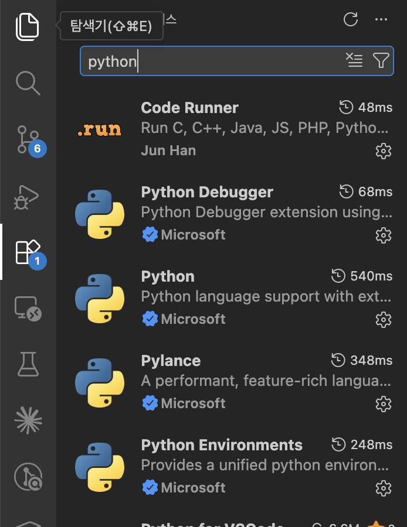
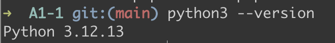
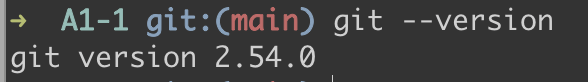
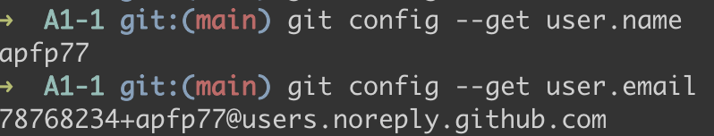
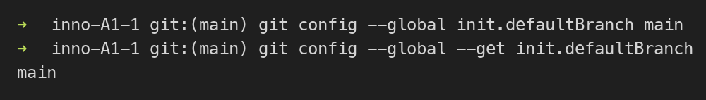
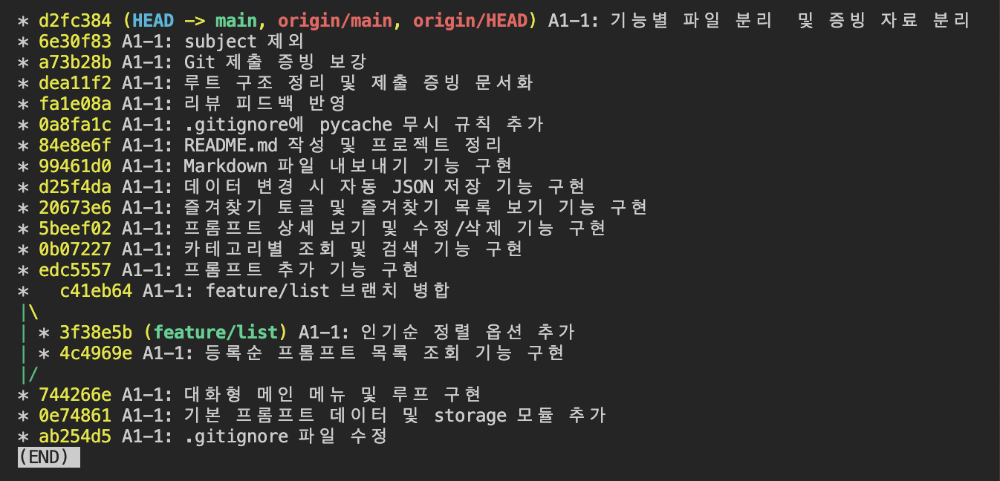

# 제출 증빙 자료

이 문서는 과제 제출에 필요한 개발 환경 설정, 프로그램 실행 결과, Git 설정 확인 자료를 정리한 문서입니다.

## 개발 환경 설정

### VSCode Python 확장 설치



### Python 버전 확인



### Git 버전 확인



### Git 사용자 정보 확인



### Git 기본 브랜치 설정 확인



## Git 작업 이력 확인

최종 제출 직전에 아래 명령어를 실행한 터미널 화면을 캡처합니다. 커밋이 추가될 때마다 결과가 달라지므로 고정된 이미지 대신 최신 명령 실행 결과를 제출용 캡처로 사용합니다.

```bash
git log --oneline --graph --decorate --all
```



과제 요구사항 확인 포인트는 다음과 같습니다.

- 최소 10개 이상의 의미 있는 커밋
- `feature/list` 브랜치 생성 기록
- `main` 브랜치로 병합된 merge commit
- 기본 브랜치가 `main`으로 설정된 증빙

## 프로그램 실행 결과

### 메인 메뉴


### 프롬프트 추가


### 프롬프트 목록


### 카테고리별 조회


### 프롬프트 검색


### 상세 보기 및 수정


### 상세 보기 및 삭제


### 즐겨찾기 관리


### 즐겨찾기 목록


### Markdown 내보내기 확인


